# TechMate - Hệ Thống thương mại điện tử tích hợp Chat Bot AI

TechMate là đồ án website thương mại điện tử chuyên cung cấp thiết bị công nghệ (Điện thoại, Laptop, Máy tính bảng, Phụ kiện...). Website tích hợp Trợ lý Trí tuệ Nhân tạo (Gemini AI Bot) và cổng thanh toán trực tuyến VNPAY.

## Getting Started

1. Tai source code ve may va dua vao thu muc htdocs cua XAMPP (neu dung XAMPP) hoac thu muc lam viec cua ban:

```bash
git clone <repo-url>
cd Good_Phone
```

2. Import co so du lieu:

- Truy cap vao phpMyAdmin: http://localhost/phpmyadmin/ (hoac port tuong ung cua ban).
- Tao mot co so du lieu moi voi ten: `mobile_store_db` (Chon kieu ma hoa: `utf8mb4_general_ci`).
- Chon database `mobile_store_db` vua tao, click vao tab **Import**, chon file `mobile_store_db.sql` trong thu muc `database MYSQL` va bam **Import** (Go) de hoan tat.

3. Cau hinh moi truong (.env):

- Tao file `.env` tai thu muc goc cua du an `Good_Phone`
- Them cac thong tin cau hinh voi key cua ban:
```env
GEMINI_API_KEY="YOUR_GEMINI_API_KEY"
VNP_TMN_CODE="YOUR_VNP_TMN_CODE"
VNP_HASH_SECRET="YOUR_VNP_HASH_SECRET"
```
- Kiem tra lai thong tin ket noi co so du lieu tai file `config/db.php`.

4. Khoi dong server va truy cap:

*   **Neu chay qua PHP Development Server (Khuyen dung):**
    Mo terminal tai thu muc du an va chay lenh:
    ```bash
    php -S localhost:3000
    ```
    Truy cap cac link:
    - Trang chu: http://localhost:3000/
    - Trang quan tri: http://localhost:3000/admin/dashboard.php

*   **Neu chay qua Apache cua XAMPP:**
    Dat thu muc vao `C:\xampp\htdocs\Good_Phone` va truy cap:
    - Trang chu: http://localhost/Good_Phone/
    - Trang quan tri: http://localhost/Good_Phone/admin/dashboard.php

### Tai khoan dang nhap

- User dang nhap: Khach hang co the tu dang ky tai khoan tren website tai trang dang ky (`register.php`).
- Tai khoan Admin: Admin dang nhap bang cach cap nhat cot `role` = `admin` cua user do trong bang `users` bang cach chay cau lenh SQL:
```sql
UPDATE users SET role = 'admin' WHERE username = 'ten_tai_khoan_cua_ban';
```

### Tai khoan thanh toan VNPAY Sandbox

- Su dung thong tin the test duoc cung cap boi VNPAY Sandbox de chay quy trinh thanh toan: https://sandbox.vnpayment.vn/apis/docs/thanh-toan-pay/pay.html#danh-sach-the-test

## Giao dien

### Dang nhap

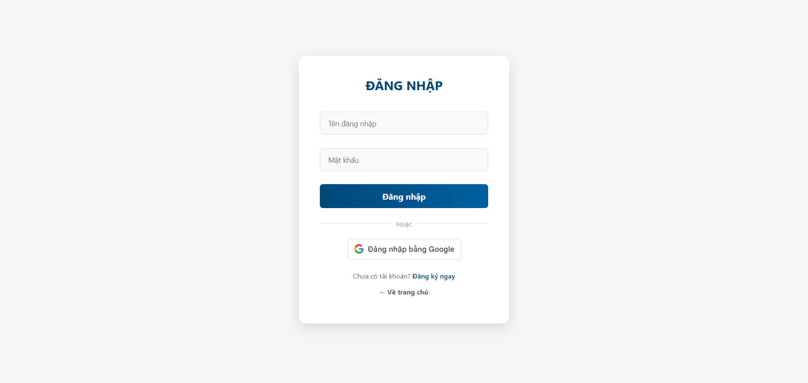

### Trang chu

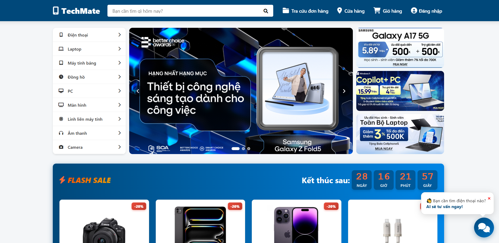

### Chat Bot AI

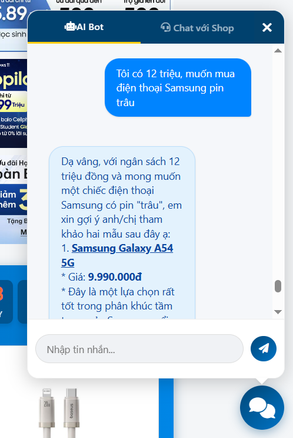

### Chat voi shop

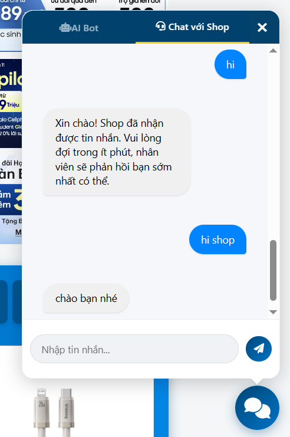

### Chi tiet san pham

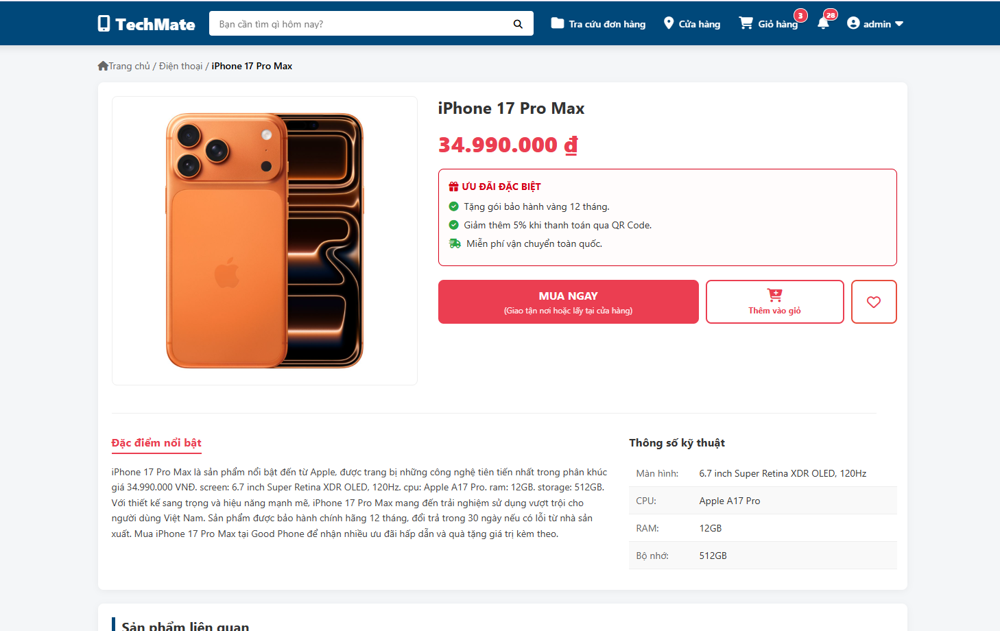

### Gio hang

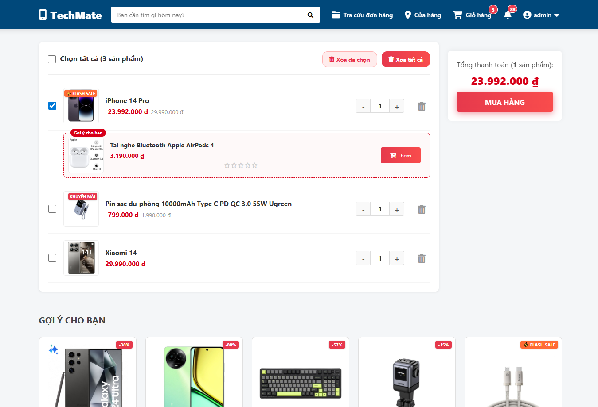

### Quy trinh thanh toan

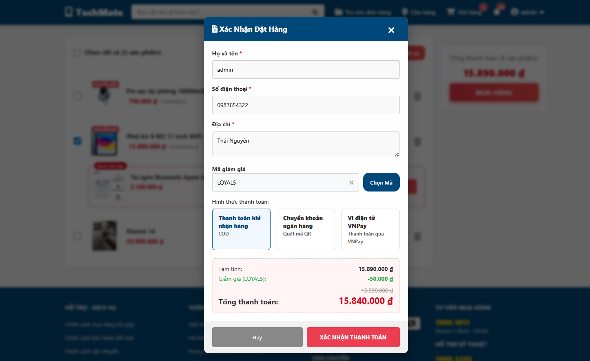

### Don hang

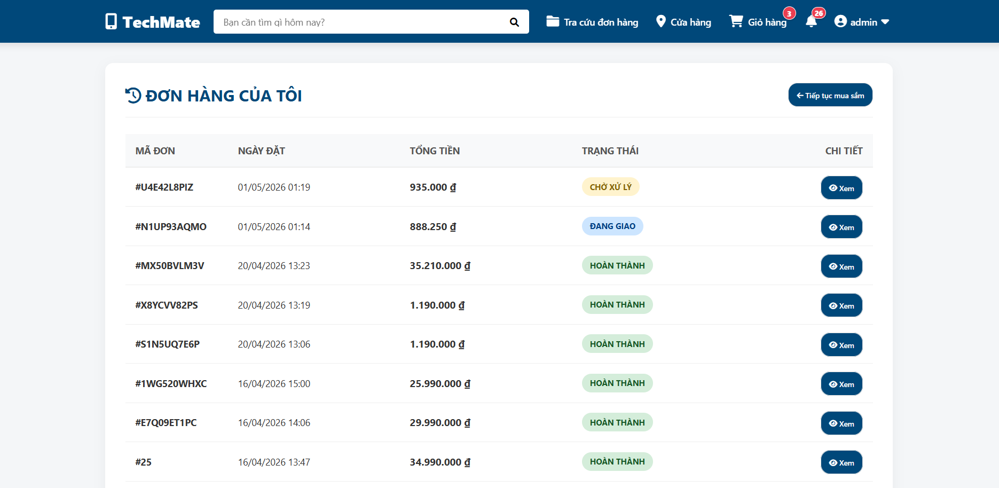

### Kho Voucher

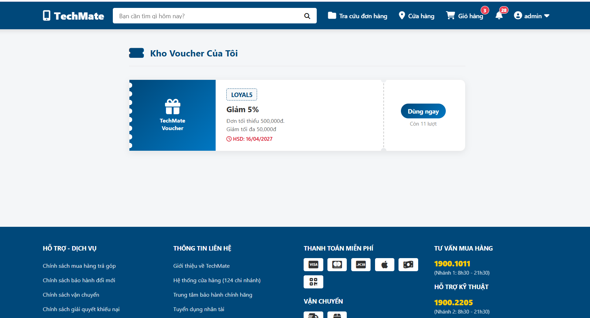

### Chinh sua ho so

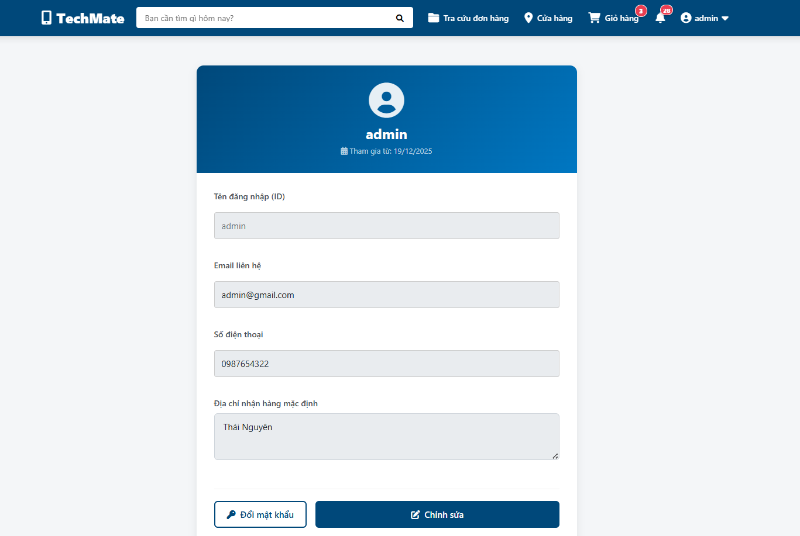

### Dashboard

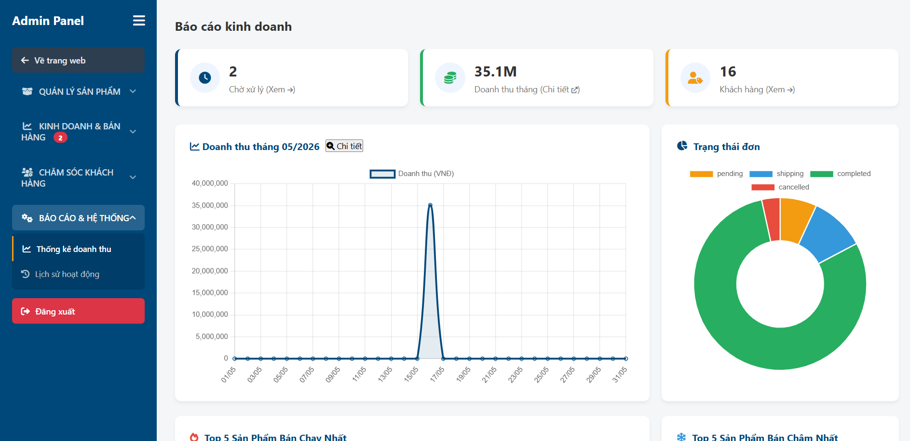

## Cong nghe su dung

- PHP (Procedural)
- MySQL
- HTML / CSS (Vanilla)
- JavaScript / jQuery
- Google Gemini API (gemini-2.5-flash)
- VNPAY Sandbox
